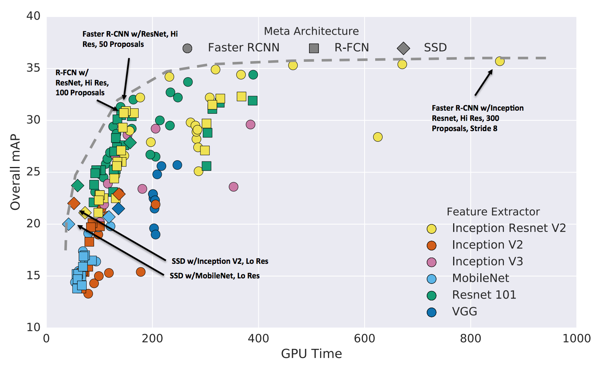

# Single Shot MultiBox Detection

Single Shot MultiBox Detection model or **SSD** is a method for detecting objects in an image using a single feed-forward convolutional neural network. Unlike other architectures like Faster R-CNN or R-FCN, SSD does not use an object proposal component, allowing it to predict classes and anchors within a single shot using the network mentioned above.

The main advantage of this architecture is that it excels in terms of speed and that it requires much fewer resources than counterpart \(Faster RCNN\). The next image from the paper "[_Speed/accuracy trade-offs for modern convolutional object detectors_](https://arxiv.org/abs/1611.10012)" by Huang et al. show that compared to Faster RCNN and R-FCN, an SSD model with a MobileNet feature extractor requires way less GPU time, but on the other hand, the detection rate and accuracy is somehow worse.

Nonetheless, TensorFlow Object Detection repo provides a [table](https://github.com/tensorflow/models/blob/master/research/object_detection/g3doc/detection_model_zoo.md) in which we can see and compare the time it takes to perform a prediction. Lastly, I personally [trained an SSD detection model to detect Pikachu and managed to get it running as an Android app](https://towardsdatascience.com/detecting-pikachu-on-android-using-tensorflow-object-detection-15464c7a60cd), showing that this architecture is capable of working on mobile devices.

