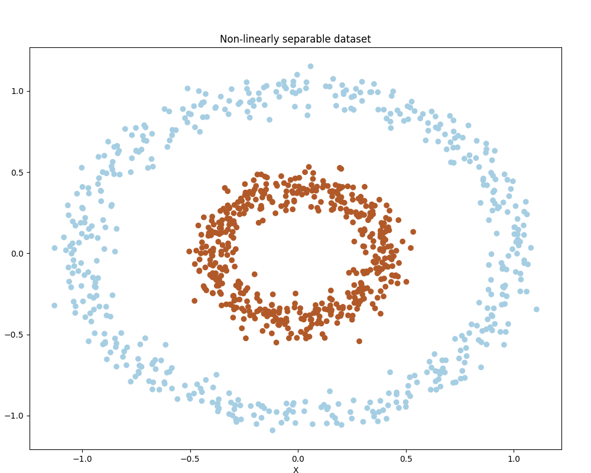
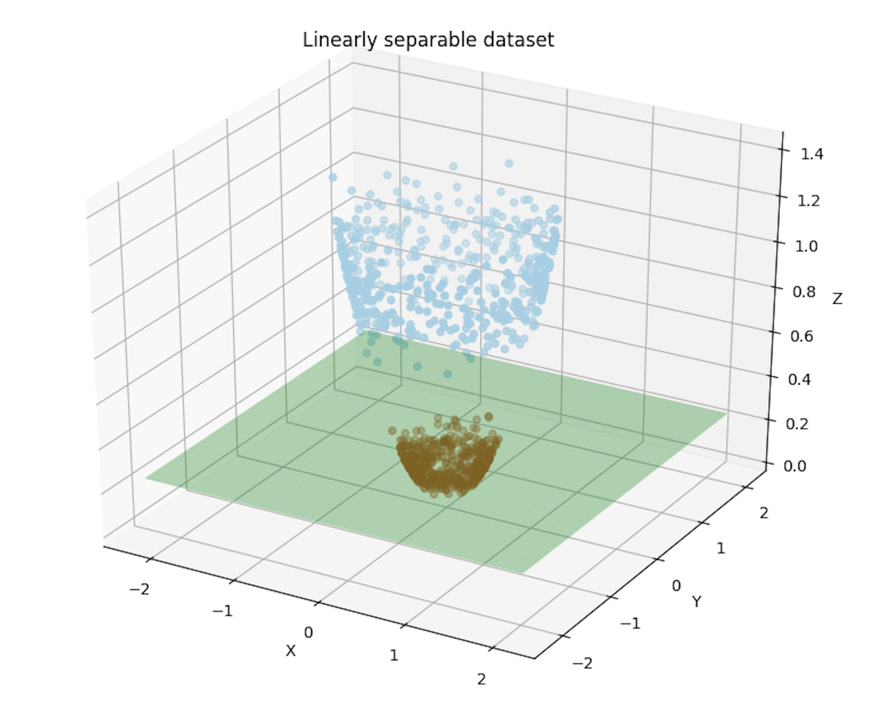

# Kernel Trick

Every now and then, when using linear methods such as Support Vector Machines \(SVM\), we could encounter the case where our dataset is not linearly separable, making it hard for the learner to learn a precise and optimal distinction between the labels of the dataset. For example, the next picture represents a dataset with data whose classes are not linearly separable, in other words, there is no a single line able to separate the dataset so that each side of the line is made of observations of the same class.



What do we do in such a case? An option is to apply what is called the "kernel trick". For starters, a kernel function is basically a mapping function that transforms a space into a higher versional version of it. These functions are really useful because by transforming the feature space into a high dimensional one, the algorithm might find a line or hyperplane that separates the dataset.

The above picture is a two-dimensional space in which there is no line that can separate the data between the A points and B points. However, see how by transforming the space from two dimensions, into three, we find a hyperplane that separates the data.



The "trick" part of the expression "kernel trick" comes from the fact that there is really no need of transforming the whole space into a high dimensional version of it. Instead, while solving an SVM, the algorithm only needs to calculate the inner product of the vectors in the feature space. For example, for a kernel function $$K$$, and input $$a$$ and $$b$$ , $$K$$ will project these data points in a high dimensional space, and it is represented by the following equation:

$$
S(x,y)= \langle K(x), K(y) \rangle
$$

### Example in Python using scikit-learn  

```python
from sklearn.datasets import make_circles, make_blobs
from sklearn.cross_validation import train_test_split
from sklearn import svm

X, y = make_circles(n_samples=1000, noise=0.06, factor=0.4)
X_train, X_test, y_train, y_test = train_test_split(X, y, test_size=0.25)

# by default svm.SVC uses a RBF kernel
# using a linear kernel
clf = svm.SVC(kernel='linear', C=1000)
clf.fit(X_train, y_train)

# using a polynomial kernel
clf = svm.SVC(kernel='poly', C=1000)
clf.fit(X_train, y_train)
```

